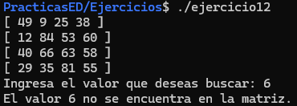

**Ejercicio 1: Declaración e Inicialización**

Crea un programa que:

1. Declare una matriz de 4x4 de tipo int

2. Inicialice todos los elementos en 0 usando ciclos anidados

3. Imprima la matriz en formato de tabla

Desafíos encontrados:

En este programa el principal desafío fue poder extraer el tamaño de
filas y columnas por medio del operador sizeof(), el cual nos
proporciona información sobre el tamaño en bytes del elemento que
deseamos. Aunque en este programa sabíamos de entrada el total de filas
y columnas que tendría la matriz y tal vez no era necesario calcularlo,
sin embargo, el utilizar este operador nos será de mayor utilidad cuando
no sabemos con exactitud el tamaño del elemento en cuestión y con ello
será más fácil el manejo de las dimensiones de matrices más grandes.

Evidencia de ejecución:

{width="2.656049868766404in"
height="0.7622397200349956in"}

**Ejercicio 2: Llenar Matriz Manualmente**

Crea un programa que:

1. Pida al usuario ingresar los 16 valores de la matriz

2. Almacene cada valor en su posición correspondiente

3. Imprima la matriz completa al finalizar

Desafíos encontrados:

En este programa el desafío principal fue la implementación de la
función scanf(), que nos sirve para capturar lo que el usuario ingresa
por teclado y poder almacenarlo en una variable o espacio reservado para
ello, es decir, esta función hace uso del operador "&" antes del nombre
del espacio reservado ya que con ello indicamos que lo que se ingrese se
va a guardar en esa dirección dada.

Evidencia de ejecución:

{width="2.9543963254593177in"
height="2.9470297462817148in"}

**Ejercicio 3: Matriz con Valores Aleatorios**

Crea un programa que:

1. Llene una matriz de 4x4 con números aleatorios entre 0 y 9

2. Imprima la matriz

3. Muestre cuántos números pares e impares hay

Desafíos encontrados:

En este ejercicio el desafío principal fue la implementación correcta de
la función srand(), la cual nos permite poder generar números aleatorios
en un determinado rango de números que queramos. Por otro lado, aunque
no se puede decir que fue muy difícil, pero que considero importante la
creación de funciones separadas para saber cuántos números pares e
impares existen en la matriz, ya que, si bien en una sola lo podríamos
crear, siempre es mejor mantener una tarea específica para cada función.

Evidencia de ejecución:

{width="4.147880577427822in"
height="1.1073972003499561in"}

**Ejercicio 4: Suma de Elementos**

Escribe un programa que:

1. Cree una matriz de 4x4 con valores aleatorios

2. Calcule la suma de todos los elementos

3. Calcule el promedio de los elementos

4. Muestre ambos resultados

Desafíos encontrados:

En este ejercicio los desafíos principales fueron crear las funciones de
suma y promedio, aunque no fue muy complicado, se puede equivocar uno al
momento de retornar valores, ya que debemos de verificar siempre el tipo
de dato que vamos a obtener y así poder anticiparnos al tipo de dato que
debemos retornar. Aunado a esto, al momento de hacer una división entre
números enteros para obtener el promedio, el resultado que me arrojaba
era solo la parte entera del resultado correcto. Buscando en internet,
me di cuenta que debía convertir al menos uno de los valores al tipo de
dato flotante para que mi resultado fuera correcto y preciso.

Evidencia de ejecución:

{width="6.266013779527559in"
height="1.1294531933508312in"}

**Ejercicio 5: Máximo y Mínimo**

Desarrolla un programa que:

1. Llene una matriz de 4x4 con números aleatorios

2. Encuentre el valor máximo y su posición (fila, columna)

3. Encuentre el valor mínimo y su posición

4. Muestre los resultados

Desafíos encontrados:

En este ejercicio, se me complico un poco las funciones de máximo y
mínimo, ya que intente hacerlas retornando valores, y me di cuenta de
que es un poco difícil, así que opte por hacer funciones que
directamente impriman el resultado en lugar de retornar ya que como son
mas de un valor, se requiere de vectores para pode manejarlos, y eso es
un tema un poco más avanzado.

Evidencia de ejecución:

{width="4.883771872265966in"
height="1.2531944444444445in"}

**Ejercicio 6: Suma por Filas y Columnas**

Crea un programa que:

1. Genere una matriz de 4x4

2. Calcule la suma de cada fila

3. Calcule la suma de cada columna

4. Presente los resultados de forma clara

Desafíos encontrados:

Para este ejercicio lo desafiante es entender como poder representar la
suma de filas y columnas de una matriz para con ello poder llevar a cabo
la creación de funciones que ayuden a cumplir con esa tarea. Para suma
por filas, no fue difícil. Para la suma de las columnas se me complico
un poco, básicamente en encontrar la lógica de que solo es cambiar
posición de columnas por filas al momento de sumar los elementos.

Evidencia de ejecución:

{width="2.4339949693788276in"
height="2.0810290901137356in"}

**Ejercicio 7: Suma de Matrices**

Implementa un programa que:

1. Cree dos matrices A y B de 4x4

2. Sume ambas matrices: C\[i\]\[j\] = A\[i\]\[j\] + B\[i\]\[j\]

3. Muestre las tres matrices (A, B y C)

Desafíos encontrados:

En este ejercicio el desafío principal fue crear la función donde
pasamos una matriz para el llenado, se me complico un poco ya que no
entendía como pasarla como parámetro, investigué en Google para saber
cómo se debía pasar como parámetro una matriz estática, y ahí encontré
la forma.

Evidencia de ejecución:

{width="2.4045286526684166in"
height="2.1904735345581803in"}

**Ejercicio 8: Resta de Matrices**

Implementa un programa que:

1. Cree dos matrices A y B de 4x4

2. Reste ambas matrices: C\[i\]\[j\] = A\[i\]\[j\] - B\[i\]\[j\]

3. Muestre las tres matrices (A, B y C)

Desafíos encontrados:

En este ejercicio el desafío principal se resolvió en el ejercicio
anterior, aquí solo fue cuestión de cambiar algunos parámetros del
anterior.

Evidencia de ejecución:

{width="2.5330304024496937in"
height="2.313094925634296in"}

**Ejercicio 9: Multiplicación de Matrices**

Implementa un programa que:

1. Cree dos matrices A y B

2. Multiplique ambas matrices: C\[i\]\[j\] = A\[i\]\[j\] \* B\[i\]\[j\]

3. Muestre las tres matrices (A, B y C)

Desafíos encontrados:

En este ejercicio el desafío principal fue encontrar la forma de poder
hacer la función de multiplicar matrices, ya que para este caso se
implementaron tres ciclos for() anidados para poder resolver el
problema, realmente me tomo mucho tiempo poder entenderlo, pero con el
uso de Google para buscar información al respecto lo puede hacer,
claramente es complicado resolverlo uno solo, no es imposible, pero
requiere de tiempo para analizar.

Evidencia de ejecución:

{width="2.1479910323709537in"
height="1.3569641294838146in"}
{width="5.446842738407699in"
height="1.384909230096238in"}

**Ejercicio 10: Matriz Transpuesta**

Crea un programa que:

1. Genere una matriz A de 3x4

2. Calcule su transpuesta AT (que será 4x3)

3. Muestre ambas matrices

Desafíos encontrados:

Para este ejercicio el desafío principal fue hacer algunos cambios en
las funciones para llenar e imprimir matriz, ya que en los ejercicios
anteriores el valor de COLUMNAS no cambiaba, por lo tanto utilizaba una
constante para el parámetro cuando pasaba una matriz, sin embargo en
este programa se invierten las cosas dado que las columnas de la matriz
A, cambia a ser las filas de la matriz T. Buscando en Google, pude darme
cuenta que necesitaba hacer un cambio en el orden del envío de
parámetros a la función para poder utilizar el parámetro columnas pasado
por la función para colocarlo en el parámetro matriz. Y ese fue el
aprendizaje de este ejercicio.

Evidencia de ejecución:

{width="3.1754068241469815in"
height="1.751010498687664in"}

**Ejercicio 11: Diagonal Principal y Secundaria**

Para matrices cuadradas (n×n):

Desarrolla un programa que:

1. Cree una matriz cuadrada de 4x4

2. Imprima los elementos de la diagonal principal (donde i == j)

3. Imprima los elementos de la diagonal secundaria (donde i + j == n-1)

4. Calcule la suma de cada diagonal

Desafíos encontrados:

En este ejercicio el desafío principal fue la implementación de las
funciones para identificar los valores de las diagonales principal y
secundaria, pero en el caso de la diagonal secundaria fue un poco mas
confuso ya que comprender el método de identificar y esos valores
requiere mayor lógica de comprensión que la de la diagonal principal.

Evidencia de ejecución:

{width="3.869991251093613in"
height="1.3474475065616798in"}
{width="3.53009186351706in"
height="1.3555544619422573in"}

**Ejercicio 12: Buscar Elemento**

Crea un programa que:

1. Genere una matriz de 4x4

2. Pida al usuario un número a buscar

3. Indique si existe y muestre todas las posiciones donde aparece

4. Si no existe, muestre un mensaje apropiado

Desafíos encontrados:

En este ejercicio el desafío principal fue hacer uso de una bandera para
validar la existencia del elemento, así como poder implementar de manera
correcta para que nos arrojara el resultado que se espera, saber si
existe el elemento que se busca y saber la posición donde se encuentra.

Evidencia de ejecución:

{width="4.294036526684165in"
height="1.1102449693788277in"}
{width="3.172178477690289in"
height="1.1316951006124234in"}
